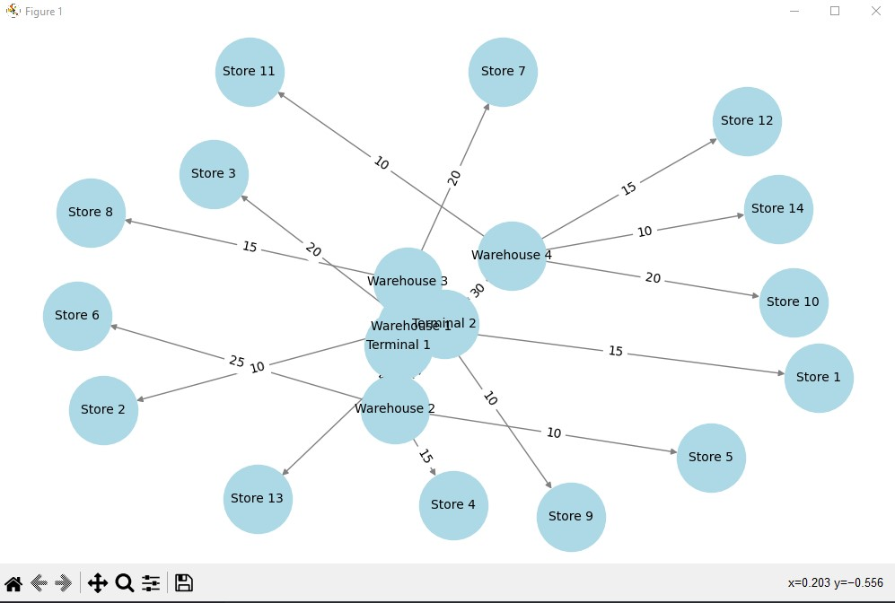

# Task 1: Maximum Flow Application for Goods Logistics

## Description

This project models a network for delivering goods from terminals to stores via warehouses. The Edmonds-Karp maximum flow algorithm is used to find the optimal distribution of goods.

## Network Graph

| From        | To           | Capacity (units) |
|-------------|--------------|------------------|
| Terminal 1  | Warehouse 1  | 25               |
| Terminal 1  | Warehouse 2  | 20               |
| Terminal 1  | Warehouse 3  | 15               |
| Terminal 2  | Warehouse 3  | 15               |
| Terminal 2  | Warehouse 4  | 30               |
| Terminal 2  | Warehouse 2  | 10               |
| Warehouse 1 | Store 1      | 15               |
| Warehouse 1 | Store 2      | 10               |
| Warehouse 1 | Store 3      | 20               |
| Warehouse 2 | Store 4      | 15               |
| Warehouse 2 | Store 5      | 10               |
| Warehouse 2 | Store 6      | 25               |
| Warehouse 3 | Store 7      | 20               |
| Warehouse 3 | Store 8      | 15               |
| Warehouse 3 | Store 9      | 10               |
| Warehouse 4 | Store 10     | 20               |
| Warehouse 4 | Store 11     | 10               |
| Warehouse 4 | Store 12     | 15               |
| Warehouse 4 | Store 13     | 5                |
| Warehouse 4 | Store 14     | 10               |

## Technologies

- Python  
- NetworkX (maximum flow algorithm)  
- Matplotlib (visualization)  
- Tabulate (table formatting)  

## Running the Program

```bash
pip install networkx matplotlib tabulate
cd maximum_flow
python maximum_flow.py
```
## Result




---

# Task 2: Comparing Efficiency of OOBTree and Dict for Range Queries

This project implements and compares two data structures — **OOBTree** (from the `BTrees` library) and Python's built-in **dict** — for storing and querying a large dataset of products. The focus is on measuring the performance of range queries on product prices.

---

## Task Description

You will:

1. Load product data from the file `generated_items_data.csv`. Each product has the following attributes:
   - `ID` (unique identifier)
   - `Name`
   - `Category`
   - `Price`

2. Store the product data in two different structures:
   - **OOBTree**: A balanced tree structure with keys as `ID` and values as product dictionaries.
   - **dict**: A standard Python dictionary with the same key-value format.

3. Implement functions to add items to each structure:
   - `add_item_to_tree(tree, item)`
   - `add_item_to_dict(items_dict, item)`

4. Implement functions to perform range queries on product prices, returning all products with prices within a given range:
   - `range_query_tree(tree, min_price, max_price)` — uses `OOBTree.items(min, max)` for efficient querying.
   - `range_query_dict(items_dict, min_price, max_price)` — performs linear search over all items.

5. Use the `timeit` library to measure and compare the total execution time of performing 100 range queries on each structure.

---

## Technical Requirements

- Use only the `OOBTree` from the `BTrees` package and the built-in `dict` for storing data.
- Implement separate functions for insertion and range querying as described above.
- Range query on `OOBTree` must utilize the `items(min, max)` method.
- Range query on `dict` must iterate over all items and filter by price.
- Perform 100 repeated range queries for each structure to get a reliable timing.
- Output the total time spent on 100 range queries for each data structure.

---

## Acceptance Criteria

1. The program returns correct and consistent results for range queries on both structures.
2. Data is correctly inserted into both `OOBTree` and `dict`.
3. The `OOBTree` uses its sorted property for efficient range queries.
4. The `dict` performs a linear search to answer range queries.
5. Execution time results for 100 range queries on each structure are printed in the format:

